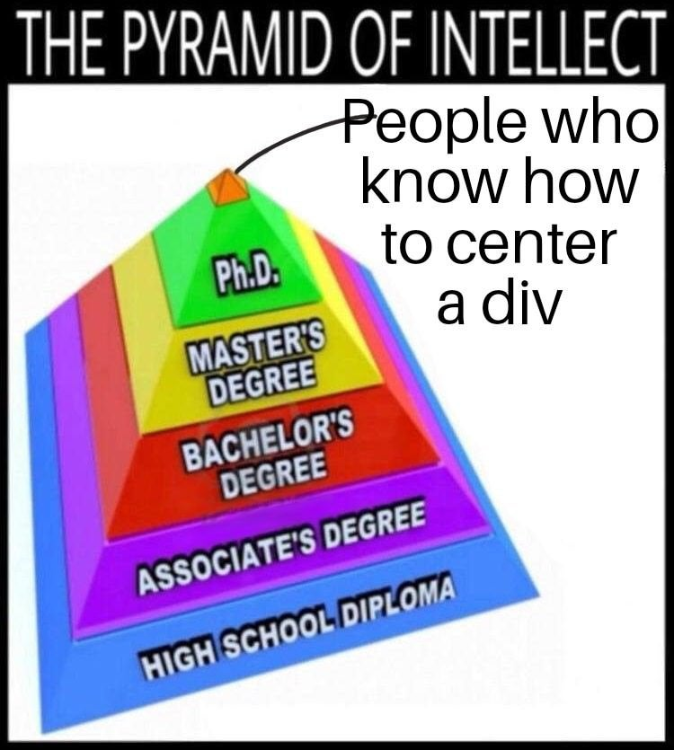

Làm web thì hẳn ai cũng sẽ phải center element sử dụng CSS, còn nhớ năm nào mình đi phỏng vấn VNG và được hỏi có bao nhiêu cách để center 1 cái div trong 1 cái div. Mình ngồi cười và sau đó đứng dậy đi về.

Giỡn chút vậy, mình sẽ thử liệt kê những cách mà mình biết.

Giả sử chúng ta chúng ta có HTML như này:

```html
<div class="container">
  <div class="element">Element</div>
</div>
```

Với ràng buộc rất đơn giản, `container` và `element` có những CSS cơ bản phía dưới. Hãy center `element` trong `container`, có thể chỉnh sửa HTML và CSS tùy ý, miễn sao ra kết quả.

```css
.container {
  padding: 16px;
  width: 100%;
  height: 200px;
  background: blue;
}
.element {
  padding: 16px;
  background: green;
}
```

Output mong đợi sẽ như thế này:

<div class="p-4 mb-10 w-full bg-blue-500 grid place-content-center h-[200px]">
  <div class="p-4 bg-green-500">Element</div>
</div>

## Cách 1: Sử dụng flex

Cách quá rõ ràng cho một browser engineer.

```css
.container {
  display: flex;
  justify-content: center;
  align-items: center;
}
```

Test:

<div class="p-4 mb-10 w-full bg-blue-500 h-[200px] flex items-center justify-center">
  <div class="p-4 bg-green-500">Element</div>
</div>

## Cách 2: Sử dụng flex nhưng mà nó lạ lắm

Cách có thể sử dụng trong một số trường hợp mà cách trên gây bug, hy vọng một ngày bạn sẽ gặp cho biết.

```css
.container {
  display: flex;
}
.element {
  margin: auto;
}
```

Test:

<div class="p-4 mb-10 w-full bg-blue-500 h-[200px] flex">
  <div class="p-4 bg-green-500 m-auto">Element</div>
</div>

## Cách 3: Sử dụng grid với \*-content

```css
.container {
  display: grid;
  justify-content: center;
  align-content: center;
  /* tương đương place-content: center; */
}
```

Test:

<div class="p-4 mb-10 w-full bg-blue-500 h-[200px] grid place-content-center">
  <div class="p-4 bg-green-500">Element</div>
</div>

## Cách 4: Sử dụng grid với \*-items

```css
.container {
  display: grid;
  justify-items: center;
  align-items: center;
  /* tương đương place-items: center; */
}
```

Test:

<div class="p-4 mb-10 w-full bg-blue-500 h-[200px] grid place-items-center">
  <div class="p-4 bg-green-500">Element</div>
</div>

## Cách 5: Sử dụng grid như flex

```css
.container {
  display: grid;
  justify-content: center;
  align-items: center;
}
```

Test:

<div class="p-4 mb-10 w-full bg-blue-500 h-[200px] grid justify-center items-center">
  <div class="p-4 bg-green-500">Element</div>
</div>

## Cách 6: Sử dụng grid như flex nhưng ngược lại

```css
.container {
  display: grid;
  justify-items: center;
  align-content: center;
}
```

Test:

<div class="p-4 mb-10 w-full bg-blue-500 h-[200px] grid justify-items-center content-center">
  <div class="p-4 bg-green-500">Element</div>
</div>

## Cách 7: Sử dụng position

```css
.container {
  position: relative;
}

.element {
  position: absolute;
  top: 50%;
  left: 50%;
  transform: translate(-50%, -50%);
}
```

Test:

<div class="p-4 mb-10 w-full bg-blue-500 h-[200px] relative">
  <div class="p-4 bg-green-500 absolute top-1/2 left-1/2 -translate-x-1/2 -translate-y-1/2">Element</div>
</div>

## Cách 8: Sử dụng display inline-block

Cách này yêu cầu phải sửa HTML một chút.

```html
<div class="container">
  <div class="element">Element</div>
  <div class="sibling"></div>
</div>
```

```css
.container {
  text-align: center;
}

.container > div {
  vertical-align: middle;
  display: inline-block;
}
.sibling {
  width: 0;
  height: 100%;
}
```

Test:

<div class="p-4 mb-10 w-full bg-blue-500 h-[200px] text-center">
  <div class="p-4 bg-green-500 inline-block align-middle">Element</div>
  <div class="inline-block w-0 h-full align-middle"> </div>
</div>

## Cách 9: Sử dụng display table, inline-block

```html
<div class="container-wrapper">
  <div class="container">
    <div class="element">Element</div>
  </div>
</div>
```

```css
.container-wrapper {
  display: table;
  width: 100%;
}

.container {
  display: table-cell;
  text-align: center;
  vertical-align: middle;
  width: 100%;
}

.element {
  display: inline-block;
}
```

Test:

<div class="w-full" style="display: table">
  <div class="p-4 mb-10 w-full bg-blue-500 h-[200px] text-center align-middle" style="display: table-cell">
    <div class="p-4 bg-green-500 inline-block">Element</div>
  </div>
</div>

## Cách 10: Sử dụng grid template

```css
.container {
  display: grid;
  grid-template-areas:
    ". . ."
    ". element ."
    ". . .";
  grid-template-rows: 1fr auto 1fr;
  grid-template-columns: 1fr auto 1fr;
}

.element {
  grid-area: element;
}
```

<div class="p-4 mb-10 w-full bg-blue-500 h-[200px] grid grid-cols-[1fr_auto_1fr] grid-rows-[1fr_auto_1fr]" style="grid-template-areas: '. . .'
    '. element .'
    '. . .'">
  <div class="p-4 bg-green-500" style="grid-area: element;">Element</div>
</div>

# Lời kết

Tùy trường hợp mà ta lại sử dụng những cách khác nhau cho mục đích center element: nội dung động, nhiều phần tử,...

Bạn còn cách nào khác? Chia sẻ cho mình biết bên dưới :D.

Đối với grid justify/align-items/content, bạn có thể đọc lại bài này để hiểu sự khác biệt: http://blog.lehuuvietanh.com/content-vs-items-css/
