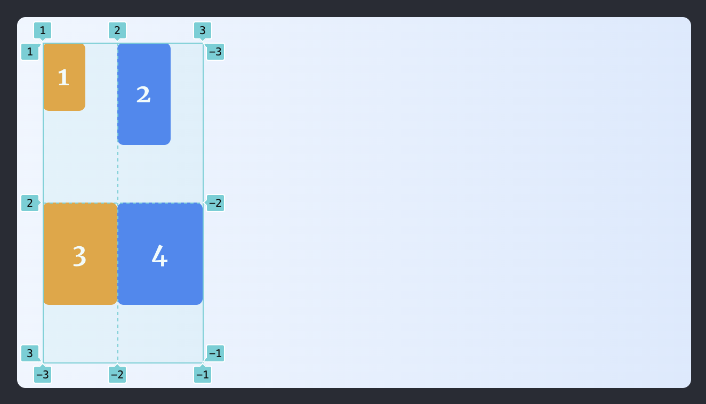
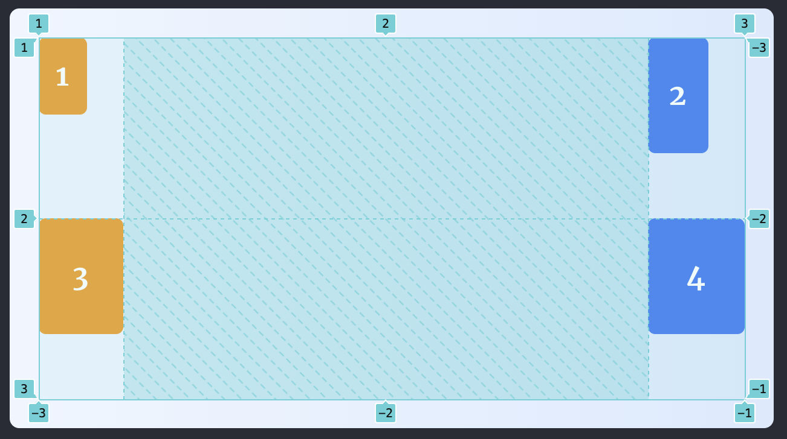
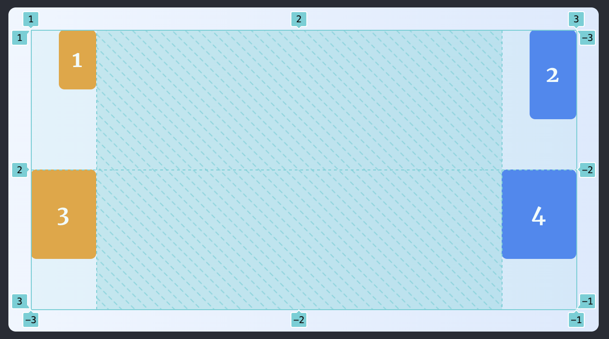

Trong bài viết này, chúng ta sẽ cùng nhau phân biệt giữa `justify-content` vs `justify-items`, `align-content` vs `align-items` được sử dụng trong Flex và Grid.

Đối với `flex` thì tùy vào direction `column` hay `row` mà ta có chức năng của `align-*` và `justify-content` sẽ khác nhau (các trục thay đổi hướng). Tuy vậy, trong bài viết này, chúng ta sẽ sử dụng hướng mặc định của flex.

## alignt-items vs align-content

Đầu tiên, chúng ta sẽ phân biệt `align-items` và `align-content` trong flex (grid tương tự).

Cho ví dụ minh họa sau:

  

    
1

    
2

  

Ta có thể thấy một số đặc điểm trong ví dụ:

1. Có 1 container chứa 2 item nằm trên 1 hàng
2. Chiều cao các item không giống nhau
3. Chiều cao các item không chiếm hết chiều cao của container

Chúng ta hãy hình dung có 1 wrapper bao bọc vừa khít các phần tử.

  

    

      
1

      
2

    

  

Và giờ chúng ta sẽ thấy rõ sự khác nhau giữa `align-items` và `align-content`.

- align-items sẽ điều chỉnh bản thân các item di chuyển theo trục dọc trong phạm vi của wrapper đó. Ví dụ chúng ta có `align-items: flex-end`:

  

    

      
1

      
2

    

  

- align-content sẽ điều chỉnh nguyên khối wrapper di chuyển theo trục dọc trong phạm vi container. Ví dụ `align-content: flex-end`:

  

    

      
1

      
2

    

  

\*\* **Lưu ý: align-content chỉ hoạt động khi container có thuộc tính flex-wrap có giá trị khác `no-wrap` (tức là `wrap` và `wrap-reverse`)**

## justify-items vs justify-content

\* Thuộc tính `justify-items` chỉ có trong `CSS Grid`

Tương tự với như align-\*, justify-content và justify-items hoạt động y hệt, nhưng chỉ khác là điều chỉnh item/content theo trục ngang.

Cho ví dụ sau:

  

    
1

    
2

    
3

    
4

  

Chúng ta có thể nhận thấy:

1. Có 2 cột, mỗi cột có 2 item có chiều rộng không bằng nhau
2. Chiều rộng cả 2 cột không bằng chiều rộng của cả container

- justify-content sẽ điều chỉnh nguyên khối wrapper (các cột) di chuyển theo trục ngang trong phạm vi của container. Ví dụ: `justify-content: space-between`.

- justify-items sẽ điều chỉnh các item trong từng cột di chuyển theo trục ngang trong phạm vi của wrapper. Ví dụ: `justify-items: end`.

## Kết luận

Để phân biệt và hiểu dễ dàng các thuộc tính item/content, chúng ta nên làm mẫu với các item có chiều rộng, chiều cao khác nhau và đặc biệt là chưa chiếm hết diện tích của container.
